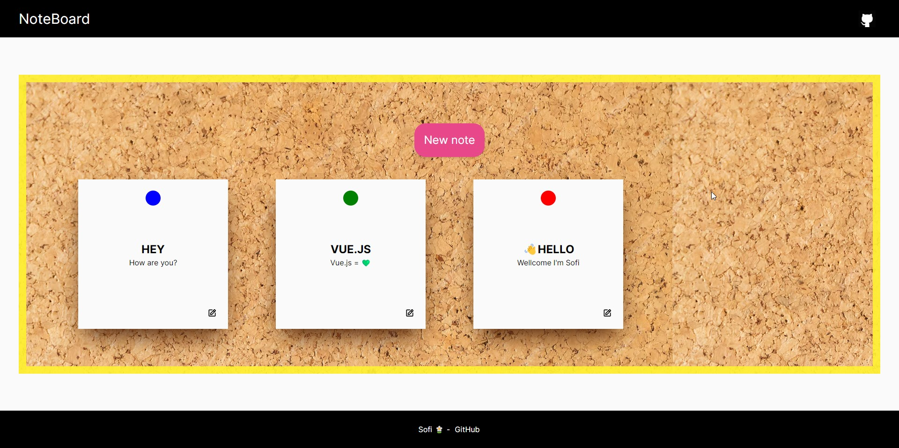

# Tack Board Full-Stack Web Application

## Overview

This project is a full-stack web application for a tack board, developed collaboratively by a remote team. The application leverages modern web technologies to create a responsive and efficient user experience.

## Technologies Used

- React
- Tailwind CSS
- Next.js
- MongoDB
- TypeScript

